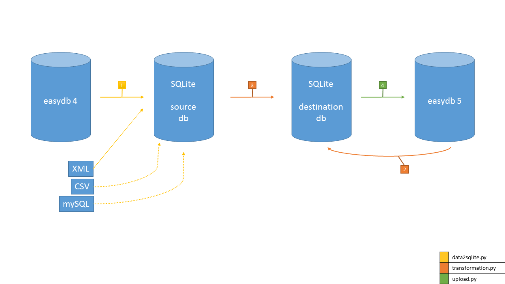

# Migration von easydb4 auf easydb5

## Grundlegend
Für die Migration werden zwei sqlite-Datenbanken erstellt. Zunächst werden die Daten von easydb4 Server
extrahiert und in einer Datenbank gespeichert, die "source.db" genannt werden muss. Diese ist im Weiteren gemeint,
wenn die Rede von "Source" ist.
Die Daten werden transformiert und in einer weiteren Datenbank Namens "destination.db" abgelegt, die im Weiteren als "Destination"
bezeichnet wird.

## Extraction/data2sqlite
Um die Source-Datenbank zu erstellen muss der gesamte Inhalt des Git-Repos "easydb-tools-migration" auf den easydb4-Server geklont oder kopiert werden.
Für die Erstellung von Source ist das Python-Tool "data2sqlite" relevant.
Mit dem aufruf

>./data2sqlite -t source.db --init easydb4 --config http://easydb.url.com username password --eas_version original:url

wird eine für die Migration taugliche sqlite Datenbank erzeugt. Für "http://easydb.url.com",
"username" und "password" müssen, entsprechend der Verwendeten Instanz andere Werte übergeben werden.
Der verwendete User braucht Root-Rechte in der Easydb.
Die Verbindungsinformationen werde naus dem Webfrontend der easydb automatisch bezogen, können aber duch das manuelle Setzen von Argumenten überschrieben werden. Wenn dies nicht geschieht muss data2sqlite auf dem selben Server wie die easydb ausgeführt werden. Des weiteren könne nmit data2sqlite auch zusätzliche Quellen in Source geschrieben werdeb.
Die Tabellen in Source werden nach folgendem Prinzip benannt

>instanz.schema.tabellen-name

## Transformation
Für den Upload der Daten müssen diese in ein zur Struktur der easydb5 kompatible Form gebracht (transformiert) werden. Zu diesem Zweck wird das Skrip "transformation.py" benötigt.
Wie bei der Extraktion müssen zunächst instanzspezifische Variablen ausgefüllt werden.
"instanz" und "schema" bleiben gleich wie beim ersten Schritt. Für die Variablen "collection_table" und
"collection_objects_table" muss in Source geschaut werden. "collection_table" muss auf den Namen der Mappen-Tabelle ("arbeitsmappen", "workfolders", o.ä.) und "collection_objects_table" auf den Namen der dazugehörigen Link-Tabelle  ("arbeitsmappe\__bilder", "workfolder\__assets", o.ä.) gesetzt werden.
Um ersichtlich zu machen, welche Transformationen nötig sind, sollte zunächst eine leere Destination aus dem Datenmodell der easydb5 erstellt werden. Zu diesem Zweck sollte im Transformation-Skript alles ab Zeile 66 auskommentiert werden und das Skript dann mit

>./transform eadb-url source-directory destination-directory --login LOGIN --password PASSWORD

ausgeführt werden (am besten den easydb-root-user verwenden, das destination-directory muss vorher angelegt weren, ebenso muss die source.db in einem Verzeichnis abgelegt werden, das mit source-direcory im Aufruf referenziert wird).

Alle Tabellen der easydb4, die Migriert werden sollen, müssen mit einem Dictionary im Transformation-Skript
beschrieben werden und dieses der Liste "tables" angehängt werden. Jedes Dictionary muss dabei folgende Form haben

```python
{
    'sql':
    """\
    SELECT
        id as __source_unique_id,
        name,
        name as "displayname:de-DE"
    FROM "{0}.{1}.table_from"
    """.format(instanz,schema),                                 #sql query (hard to automatize, because of varying join, etc.), all fields are examples, must replace those
    'table_from': '{0}.{1}.table'.format(instanz, schema),      #table in source
    'table_to': 'easydb.table',                                 #table in destination
    'has_parent': False,                                        #True if Object is part of a List with hierarchical ordering
    'has_pool': False,                                          #True if records of this table are orgranized in pools
    'has_asset': False                                          #True if record has a file attached to it
    'asset_columns': [AssetColumn(instanz, '{}.table'.format(schema), 'column', 'table', 'column', ['url'])]
    'objects_table': None
}
```
* Im Key 'sql' wird die SQL-Query abgelegt, die Daten aus Source holt und in das Format der Destination bringt (sourc_column as destination_column).
* Die Key "table_from" und "table_to" enthalten den Tabellen-Namen in Source, bzw. Destination.
* "has_parent" muss True sein für alle Datensätze, die hierachisch organisiert sind.
* "has_pool" muss True sein für alle Datensätze, die in Pools organisiert sind.
* "has_asset" muss True sein für alle Datensätze, die Assets besitzen. Für diese muss auch der key
* "assett_collumns" gesetzt sein.
* Für "objects_table" muss nur bei Tabellen gesetzt werden, die Arbeitsmappenobejkte enthalten (Link-Tabelle zwischen Datensätzen und Arbeitsmappen). Hier wird die Datensatztabelle eingetragen (z.B.: easydb.bilder o.ä.)

Für User, Gruppen, Pools und Mappen sind beriets Dictionaries definiert. Alles weitere muss händisch hinzugfügt werden. Wenn alle Tabellen mit einem Dictionary beschrieben  und diese der Liste "tables" angehängt wurden, kann die Transformation mit

>./transform eadb-url source-directory destination-directory --login LOGIN --password PASSWORD

gestartet werden. Vorher muss der zuvor auskommentierte Code wieder ausführbar gemacht werden.

## Upload

Um die Daten von Destination ins Zielsystem zu übertragen, muss das Uplaod-Skript "upload.py" ausgeführt werden. Dies kann unter Umständen sehr lange dauern. Es ist daher ratsam alle bisher erzeugten Daten und das "easydb-tools-migration"-Verzeichnis auf das Zielsystem zu übertragen.
Die Anpassungen im Upload-Skript sind minimal. Es müssen lediglich der Liste "objecttypes" die Tabellen hinzugefügt werden, die in die easydb5 übertragen werden sollen. Ausgeschlossen sind Link-Tabellen (in Destination habe diese die Form "Datensatz__nested-datensatz"). Standardmäßig sind bereits die Tabellen für Benutzer, Gruppen, Arbeitsmappen  und Pools berücksichtigt.

Wenn alle Objekttypen vermerkt sind, kann der uplaod mit

>./upload.py http://localhost http://localhost/eas eas-instanz source/ destination/ --login LOGIN --password PASSWORD

auf dem Zielsystem gestartet werden (ggF. müssen Verzeichnisse und URLs angepasst werden). Es ist ratsam diesen Aufruf in einem Screen zu starten, damit das Skript auch bei geschlossener SSH-Session weiterlaufen kann.


# Hotfolder Import

Über den Hotfolder können Dateien in die easydb Importiert werden. Um die Dateistruktur in der easydb5 abzunilden können die Verzeichnisse als Schlagworte o.ä. in der easydb mittels CSV-Importer angelegt werden.
Zum erzeugen einer solchen CSV-Datei kann das Tool filetree2csv.py verwendet werden. Es wird per Konsole mit Python 2 Interpreter aufgerufen. Das Argument "--input"/"-i" nimmt das Toplevel-Verzeichnis der zu importierenden Daten entgegen. Das "--output"/"-o" nimmt den Namen und den Pfad zur Zieldatei entgegen. Standardmäßig (keine Argumente übergeben) wird das aktuelle Arbeitsverzeichnis verwendet und die CSV-Datei struct.csv ausgegeben.

Aufruf Windows:

> python -2 filetree2csv.py

Aufruf Mac/Linux/BSD (Abhängig von env):

> python filetree2csv.py

Mit Argumenenten:

> python -2 filetree2csv.py -i Datenverzeichnis -o dateistruktur.csv

Im CSV-Importer muss dann die CSV-Spalte "filename_and_path" auf das Feld "asset#original_filename" gemappt werden. Mittels dieses Mappings lassen sich auch weitere Felder in die easydb laden.
